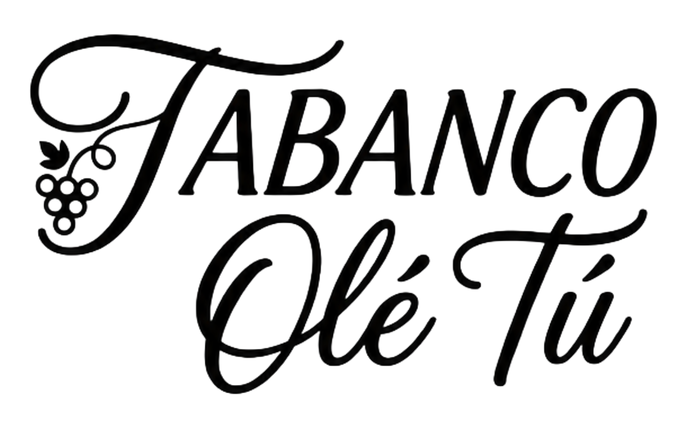

<div align="center">
  
  <h1>Tabanco Ole Tu</h1>
  <p><strong>Elegant bilingual Astro site for a family-run tabanco in Espartinas, Sevilla.</strong></p>
  <p>Wine bar · Tapas · Spanish/English · Cloudflare Pages</p>
  <p>
    <a href="#local-development">Run locally</a>
    ·
    <a href="#cloudflare-pages">Deploy</a>
    ·
    <a href="#content-updates">Edit content</a>
  </p>
  <p>
    
    
    
  </p>
</div>

<p align="center">
  
</p>

## What This Site Does

- Presents Tabanco Ole Tu with a warm cream, botanical, wine-bar visual system.
- Makes reservations simple with phone and WhatsApp actions.
- Links visitors directly to the digital menu.
- Shows the location with an embedded Google Maps frame.
- Supports Spanish-first content with an English language switch.
- Builds as a static Astro site for Cloudflare Pages.

## Local Development

```bash
npm install
npm run dev
```

Astro prints the local preview URL in the terminal.

## Scripts

| Command | Purpose |
| --- | --- |
| `npm run dev` | Start the local Astro dev server. |
| `npm run build` | Build the static site into `dist/`. |
| `npm run preview` | Preview the built site locally. |
| `npm run cf:login` | Log in to Cloudflare with Wrangler. |
| `npm run cf:whoami` | Check the active Cloudflare account. |
| `npm run deploy:pages` | Build and upload `dist/` to Cloudflare Pages. |

## Project Structure

```txt
public/              Static images and decorative assets
src/components/      Page sections and shared UI components
src/data/site.ts     Spanish/English content, links, and business info
src/layouts/         Base document layout
src/pages/           Astro routes
src/styles/          Global design system and responsive styles
wrangler.jsonc       Cloudflare Pages direct-upload config
```

## Cloudflare Pages

Recommended setup for automatic deploys:

1. Push this repository to GitHub: `alesgsanudoo/TabancoWebsite`.
2. In Cloudflare Pages, create a new project from GitHub.
3. Use these build settings:

```txt
Framework preset: Astro
Build command: npm run build
Build output directory: dist
Root directory: /
Production branch: main
Node version: 22
```

This is the best path when every push to `main` should deploy automatically.

## Wrangler Direct Upload

The project also supports manual Cloudflare Pages uploads:

```bash
npm run cf:login
npm run cf:whoami
npm run deploy:pages
```

Use direct upload when you want to publish the current local build. If you want GitHub auto-deploys, create the Pages project through the Cloudflare dashboard Git integration instead of starting as a direct-upload Pages project.

## Custom Domains

After the Pages project exists, attach both hostnames in Cloudflare Pages:

```txt
tabancooletu.com
www.tabancooletu.com
```

The domain is already registered in Cloudflare, so Cloudflare can manage the DNS records during custom-domain setup. Choose one hostname as the primary public URL and redirect the other to it if the Pages domain settings offer that option.

## Content Updates

Most public text, links, phone numbers, social URLs, map copy, and language strings live in:

```txt
src/data/site.ts
```

After content or style edits, verify the static build:

```bash
npm run build
```

## Design Notes

The visual system is documented in:

```txt
DESIGN.md
PRODUCT.md
```

The design uses deep tabanco green, warm cream backgrounds, pale sherry-gold details, sage botanical decoration, and lavender grape accents.
